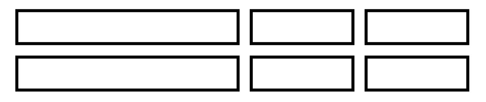
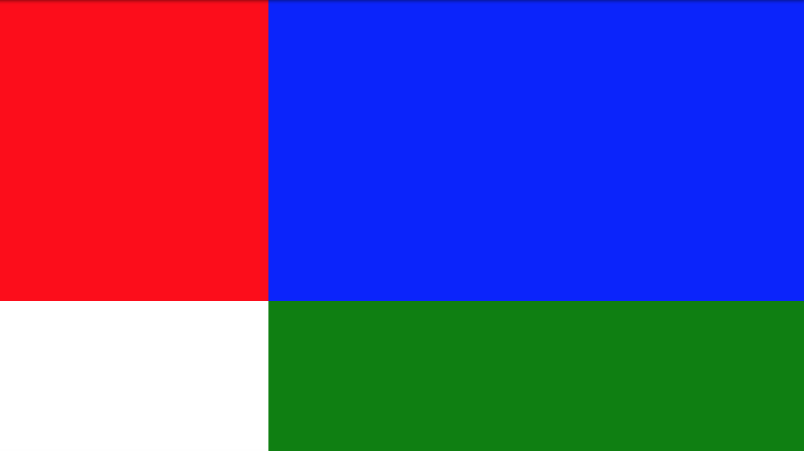
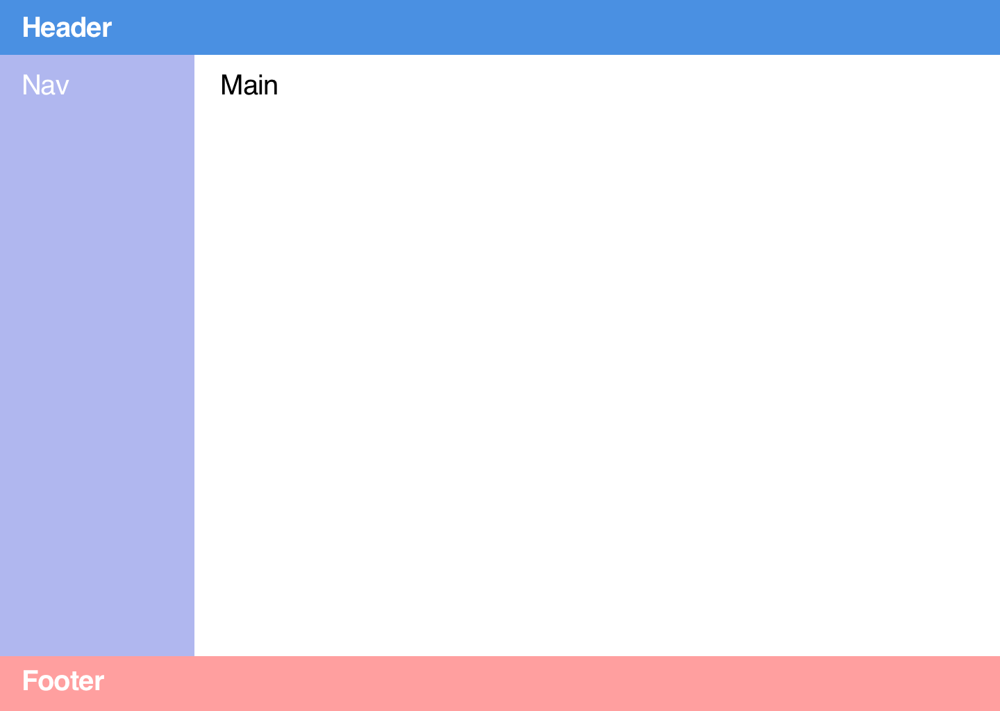
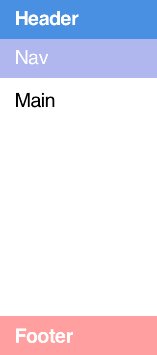

# Grid

## Litt terminologi

(Hemningsløst stjålet fra [A Complete Guide to Grid](https://css-tricks.com/snippets/css/complete-guide-grid/), som forøvrig er en veldig god guide)

### Grid line
The dividing lines that make up the structure of the grid. They can be either vertical ("column grid lines") or horizontal ("row grid lines") and reside on either side of a row or column. Here the yellow line is an example of a column grid line.


### Grid cell 
The space between two adjacent row and two adjacent column grid lines. It's a single "unit" of the grid. Here's the grid cell between row grid lines 1 and 2, and column grid lines 2 and 3.


### Grid area
The total space surrounded by four grid lines. A grid area may be comprised of any number of grid cells. Here's the grid area between row grid lines 1 and 3, and column grid lines 1 and 3.


### Grid track (Ikke kjempemye brukt tror jeg. Vanligere å referere til rader og kolonner)
The space between two adjacent grid lines. You can think of them like the columns or rows of the grid. Here's the grid track between the second and third row grid lines.


## 1 - Et enkelt grid

Åpne `index.html`. Per nå inneholder denne bare seks `div`-er, som har fått en ramme og litt padding, for at de skal være tydeligere. Målet er å få disse boksene til å se ca slik ut:



For å definere noe som en grid-container, bruker vi `display: grid`.

1. Gjør `body` til en grid-container. 

I motsetning til `display: flex`, så gjør ikke `display: grid` så mye uten noen flere egenskaper.

For å definere antall rader og kolonner i et grid, og størrelsen på dem, bruker vi henholdsvis `grid-template-rows` og `grid-template-columns`. F.eks. kan vi definere antall kolonner slik: `grid-template-columns: 100px 1fr 2fr`. Dette vil lage tre rader, der den første er 100px bred, og de to neste tar opp henholdsvis én og to brøkdeler (`fr` = fraction) av den resterende bredden. Størrelsen på en rad eller en kolonne kan også defineres som prosent, eller som `auto`.

I dette eksempelet har vi to rader som er like høye, og tre kolonner, der den første er dobbelt så bred som de to neste.

2. Bruk `grid-template-columns` til å definere de tre kolonnene, som har ulik størrelse. 
   
Dæven! Var det så lett? Det eneste som mangler nå er litt mellomrom mellom boksene. Og dette er ganske greit dette også. `grid-gap` lar oss definere dette. Den tar to verdier (adskilt med mellomrom), der den første definerer avstand mellom rader og den andre avstand mellom kolonner. På samme måte som med f.eks. `margin`, vil begge få samme verdi, dersom vi kun sender inn én verdi.

3. Bruk `grid-gap` for å sette en avstand på `10px` mellom hver boks.

For å se litt på hvordan `grid-template-rows` funker, må vi først sette inn litt innhold i en av boksene.

4. Skriv noe kort inn i den første `div`-en. Hvordan er høyden på den andre raden, sammenlignet med den første raden nå? Hva skjer hvis du definerer høyden til de to radene eksplisitt, ved hjelp av `grid-template-rows: 1fr 1fr;`? Hva skjer hvis du endrer én av dem til `2fr`, eller hvis du endrer begge til `auto`?

Gitt at vi skulle hatt f.eks. 5 kolonner på 50px, så kan det jo virke litt tåpelig å måtte skrive `grid-template-columns: 50px 50px 50px 50px 50px`. Da kan vi i stedet bruke funksjonen `repeat()`, slik `grid-template-columns: repeat(5, 50px)`.

## 2 - CSS grid garden

Noen ganger ønsker vi kanskje et litt mer spesielt grid, slik som det som er vist under.


Da er vi nesten nødt til å definere ved hvilken `grid-line` hver celle skal starte og evt slutte ved. Vi kan eksplisitt navngi grid lines, men dersom vi ikke gjør det, vil de simpelthen få en tallverdi. I eksempelet over vil disse ha følgende verdier:


```css
.container {
    display: grid;
    grid-template-columns: repeat(3, 1fr);
}

.item-2 {
    /* Her sier vi at det andre elementet i gridet skal
    strekke seg fra grid line nr 2 til grid line nr 4. */
    grid-column: 2 / 4;

    /* Evt kunne vi bare sagt at vi vil at elementet skal
    strekke seg over to celler */
    grid-column: span 2;
}

```

Som seg hør og bør finnes det et spill som lar en øve litt på disse tingene: https://cssgridgarden.com/


## 3 - Templates areas

Vi har sett litt på hvordan vi kan få en gridcelle til å fylle flere rader eller kolonner. Men dette kan jo fort bli litt tungvint i lengden, og det er heller ikke nødvendigvis lett å visualisere hvordan f.eks. `grid-area: 1 / 4 / 6 / 5;` vil se ut. I mange tilfeller kan det derfor være lettere å benytte seg av såkalte `grid-template-areas`. 

Kort forklart går _Grid Template Areas_ ut på at man gir hvert grid item et navn, med `grid-area`-propertien, for deretter å "tegne" layouten med `grid-template-areas`. F.eks.:

```css
.item-1 {
    grid-area: a;
    background: red;
}

.item-2 {
    grid-area: b;
    background: blue;
}

.item-3 {
    grid-area: c;
    background: green;
}

.container {
    display: grid;
    grid-template-areas: 
        'a b b'
        'a b b'
        '. c c'
}

```

Resultatet av dette vil se slik ut: 



Dersom man ikke eksplisitt definerer kolonnebredder eller radhøyder (med `grid-template-columns` og `grid-template-rows`), beregnes disse automatisk slik at hver celle definert i `grid-template-areas` utgjør `1fr`. Hvis du vil leke deg litt med hvordan spesifisering av rader og kolonner påvirker dette gridet i eksempelet over, kan du gjøre det [her](https://codepen.io/mfeiring/pen/xNEqjR).

For en noe mer gjennomgående beskrivelse, kan du ta en kikk på [denne MDN-artikkelen om Grid Template Areas](https://developer.mozilla.org/en-US/docs/Web/CSS/CSS_Grid_Layout/Grid_Template_Areas). 


### Oppgave

I denne oppgaven skal vi gjenskape følgende layout med grid. Dette er jo ikke nødvendigvis det mest kompliserte eksempelet, men det er fint utgangspunkt for å illustrere template areas.



Ta utgangspunkt i filene i `3 - template areas`-mappa.

1. Begynn med å gi `body` en minimumshøyde på `100vh`, og gjør den til en grid-container.

2. Bruk `grid-area` for å definere et navn for hvert grid-item (header, nav, main og footer). Og bruk `grid-template-areas` for å definere hvordan disse skal plasseres i gridet. Du trenger ikke å tenke på størrelsesforholdet mellom rader og kolonner enda.

Header og footer skal være 100px høye, og navigasjonsblokka skal være 250px bred.

3. Bruk `grid-template-rows` og `grid-template-columns` for å sette verdiene satt over.

Noe av det som er spesielt digg med `grid-template-areas` er at det gjør det veldig lett å stokke om på elementer i f.eks. media-queries. La oss si at siden over skal se slik ut på mobil:

  

1. Lag en media-query som gjelder for skjermer som er mindre enn `700px` brede.
2. Overskriv `grid-template-areas` inne i media-querien, slik at layouten matcher skissen for mobil.
3. Gjør de nødvendige endringene på `grid-template-rows` og `grid-template-columns`.
